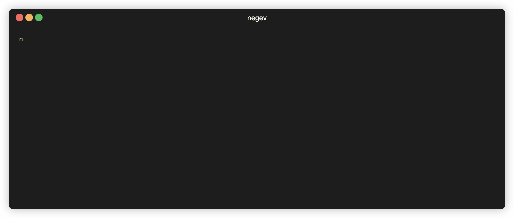

# @negev/cli

[](https://img.shields.io/npm/v/@negev/cli)
[](https://travis-ci.com/marhaupe/graphql-loadtest)

<!-- [](https://codecov.io/gh/marhaupe/negev) -->

> Benchmark your GraphQL servers with ease.

## Installation

```bash
npm install -g @negev/cli
```

## Demo


